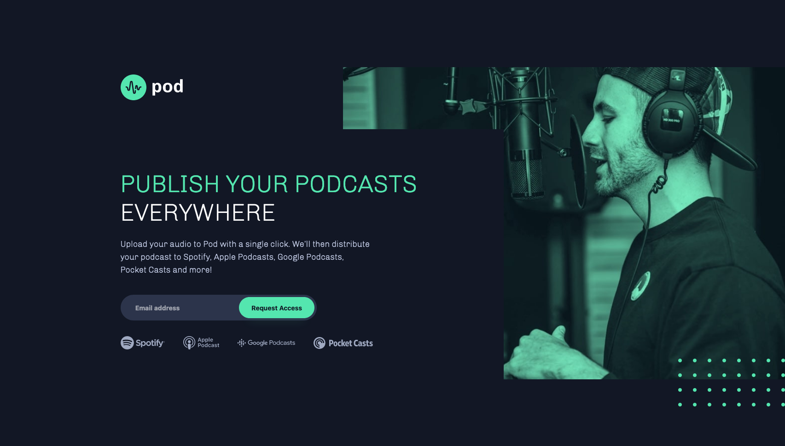
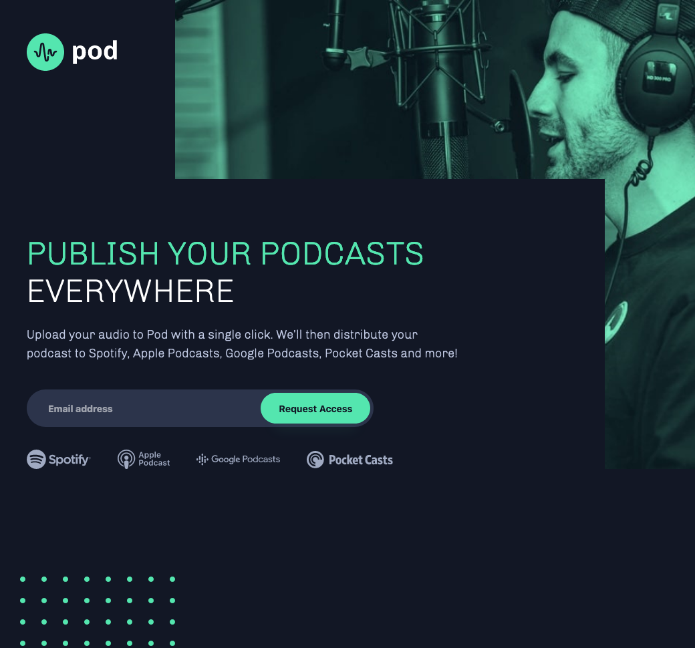
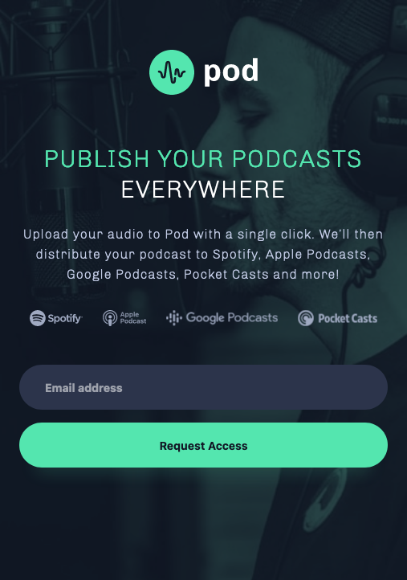

# Podcast Landing Site

This landing page for a fictional podcast site was meant for me to practice my design and organizational skills in relation to front-end development.

It's responsive to mobile, tablet, and desktop screen sizes and leverages CSS grid to accommodate the varying layouts.

## Overview

### The Challenge

Users should be able to do the following:

- View the optimal layout depending on their device's screen size
- Receive an error message when the form is submitted if:
  - The `Email address` field is empty, showing "Oops! Please add your email"
  - The email is not formatted correctly, showing "Oops! Please check your email"

### Built With

- Vanilla JavaScript
- Semantic HTML5 markup
- SCSS custom properties
- Flexbox
- CSS Grid

### Screenshots

Desktop:

Tablet:

Mobile

### Continued Development

Long-term, taking the lessons I've learned from this project, I hope to continue finding more efficient ways to organize/modularize my SCSS files.

As this was a small project, the number of SCSS files required were limited. Should this project have been on a larger scale, it would certainly require more thought into how it could be maintainable.

CSS Grid also proved to be incredibly useful in arranging the varying layouts at different media query sizes. However, I found myself fumbling with the different measurement units I could leverage on CSS Grid, resulting in some components not resizing perfectly at certain widths. This is also something I need to improve on.
